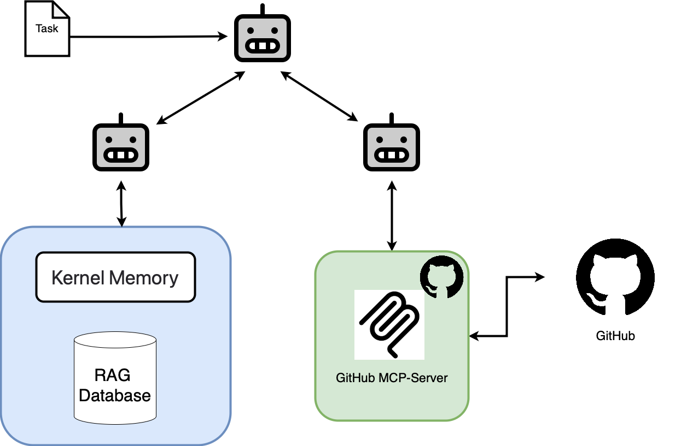

# Demo for Agents with Flock:



## Dependencies:

- `python` >= 3.11.x
- `uv` - package manager
- `docker` 

## Environment Variables:

In order for the application to have everything it needs,
a few Environment Variables will need to be set in 
a `.env`-file at the root of this project (`./.env`):


```
# --- LLM Settings ---
AZURE_API_KEY="YOUR_API_KEY_FOR_AZURE_OPENAI"
AZURE_API_BASE="https://yourdeploymentregion.api.cognitive.microsoft.com/"
AZURE_API_VERSION="2024-12-01-preview"
DEFAULT_MODEL="azure/<deployment-name>"
DEFAULT_MODEL_TEMPERATURE=1.0
DEFAULT_MODEL_MAX_TOKENS=8000

# --- Logging ---
LOG_LEVEL="WARNING"
LOGGING_DIR="log"
GITHUB_PERSONAL_ACCESS_TOKEN="YOUR PERSONAL GITHUB ACCESS TOKEN WITH PERMISSIONS TO MANAGE YOUR REPOSITORIES."
```

## Setup:

run: `uv sync` to install the necessary python dependencies.

### Services:

This project depends on two services:

1. `docker`
2. `Kernel-Memory` by Microsoft for RAG-Features

Setting up docker should be straightforward.

However, the application expects a `Kernel-Memory` instance
to listen at `http://localhost:9001/`.

For that, we need to start a dedicated docker-container.

### Setting up Kernel-Memory:

In [`./kernel-memory-config/appsettings.Development.json`](./kernel-memory-configs/appsettings.Development.json)
you can find the configuration for the kernel-memory service.

Here, you will need to adjust two sections:

```json
      "AzureOpenAIEmbedding": {
        "Auth": "ApiKey",
        "AzureIdentityAudience": null,
        "Endpoint": "https://YOUR_DEPLOYMENT_ENDPOINT.api.cognitive.microsoft.com/",
        "APIKey": "YOUR_API_KEY",
        "Deployment": "YOUR_EMBEDDING_MODEL_DEPLOYMENT_NAME",
        "MaxTokenTotal": 8191,
        "Tokenizer": "cl100k",
        "EmbeddingDimensions": null,
        "MaxEmbeddingBatchSize": 1,
        "MaxRetries": 10,
        "TrustedCertificateThumbprints": [],
        "APIType": "EmbeddingGeneration"
      },
      "AzureOpenAIText": {
        "Auth": "ApiKey",
        "AzureIdentityAudience": null,
        "Endpoint": "https://YOUR_DEPLOYMENT_ENDPOINT.api.cognitive.microsoft.com/",
        "APIKey": "YOUR_API_KEY",
        "Deployment": "YOUR_TEXT_GENERATION_MODEL_DEPLOYMENT_NAME (e.g. gpt-4.1-nano)",
        "MaxTokenTotal": 16384,
        "Tokenizer": "o200k",
        "APIType": "ChatCompletion",
        "MaxRetries": 10,
        "TrustedCertificateThumbprints": []
      },
```


Once you have that sorted out, you can start the docker-container for `Kernel-Memory` with:

```bash
docker run --volume ./kernel-memory-configs/appsettings.Development.json:/app/appsettings.Production.json -it --rm -p 9001:9001 kernelmemory/service
```

### Running the Application:

After you have performed the necessary setup steps, just run:

```bash
uv run main.py
```


### Demo Prompt:

You can find a demo-prompt in [`./demo_prompt.txt`](./demo_prompt.txt) that 
will instruct your agents to implement the Task Management Application that is specified
in [`./files_for_memory`](./files_for_memory/)
